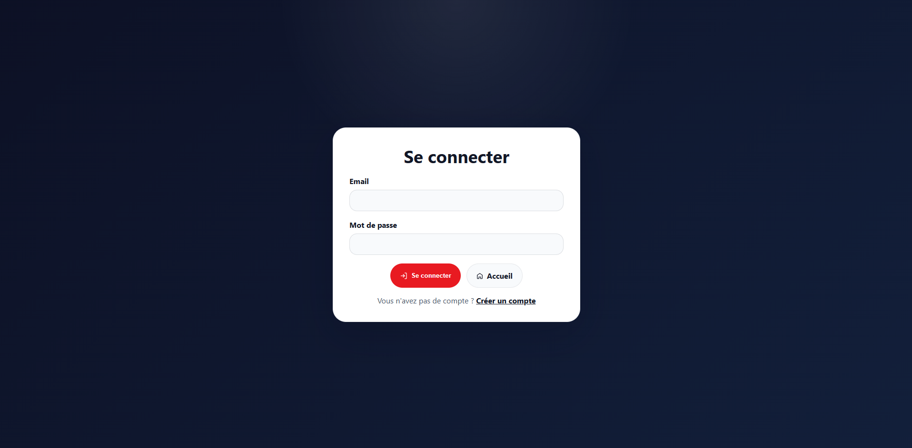
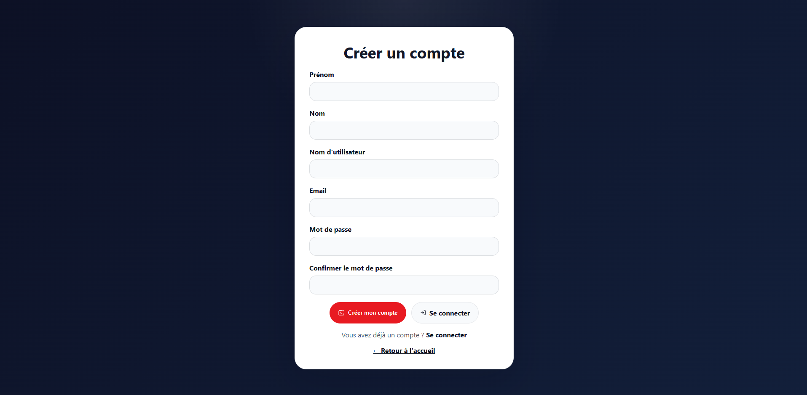
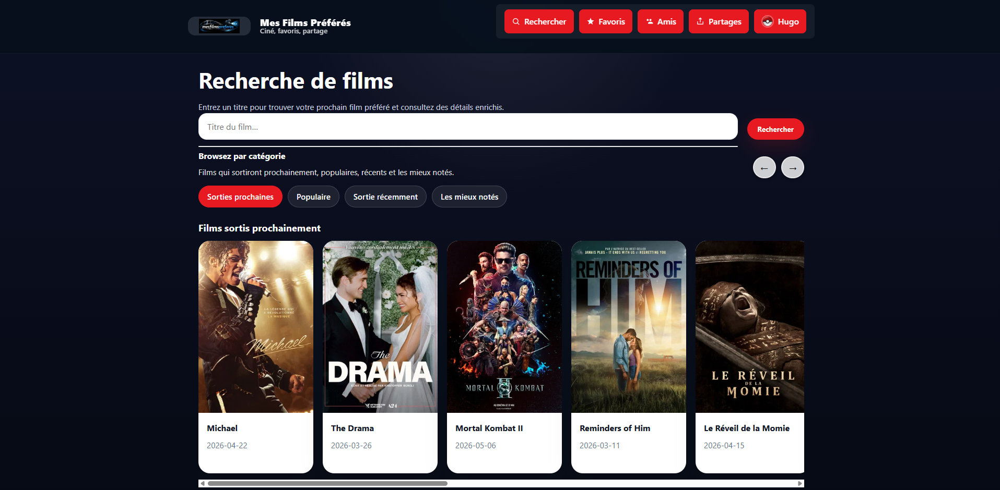
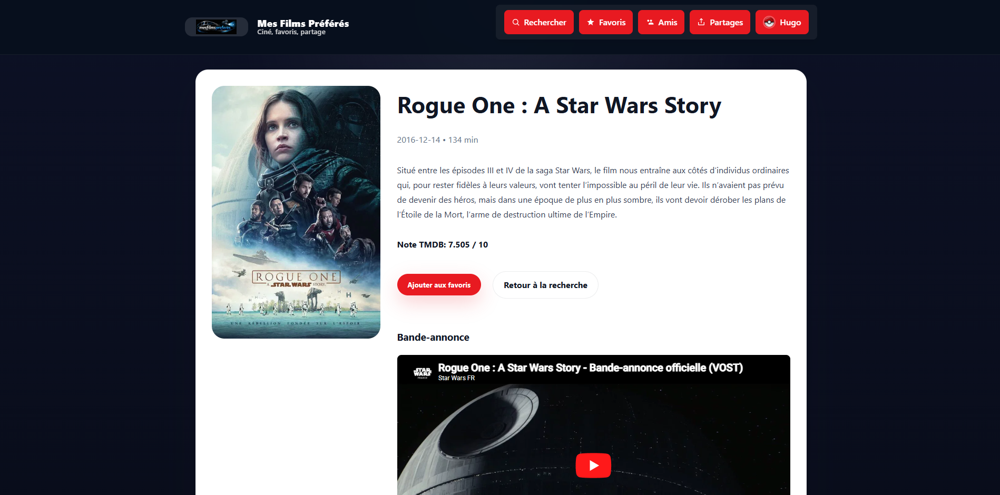
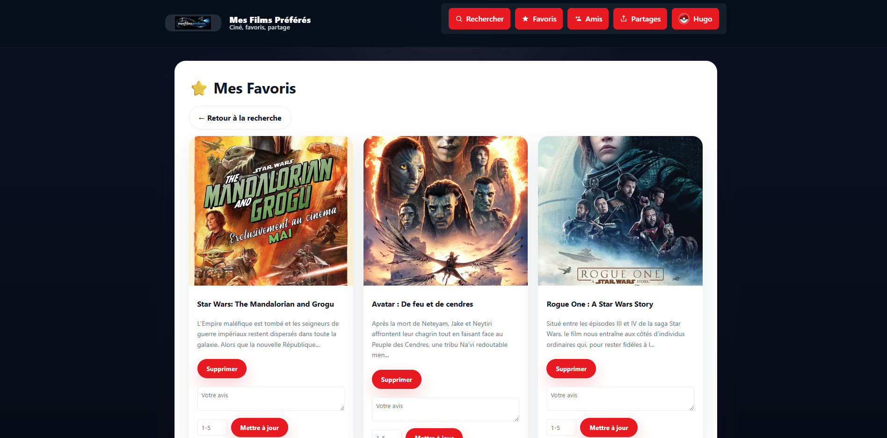
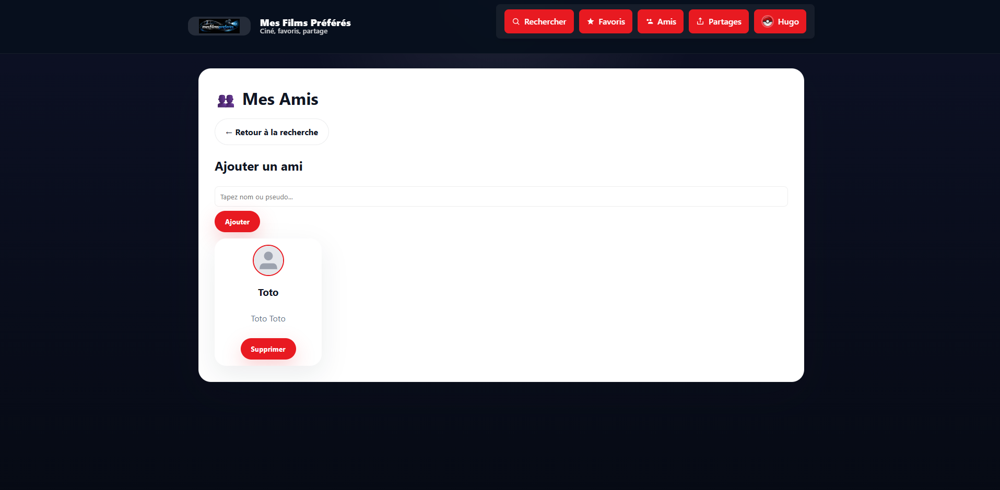
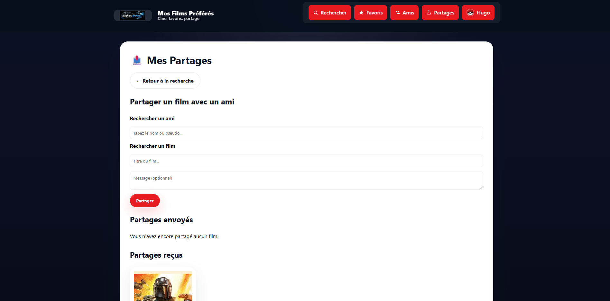
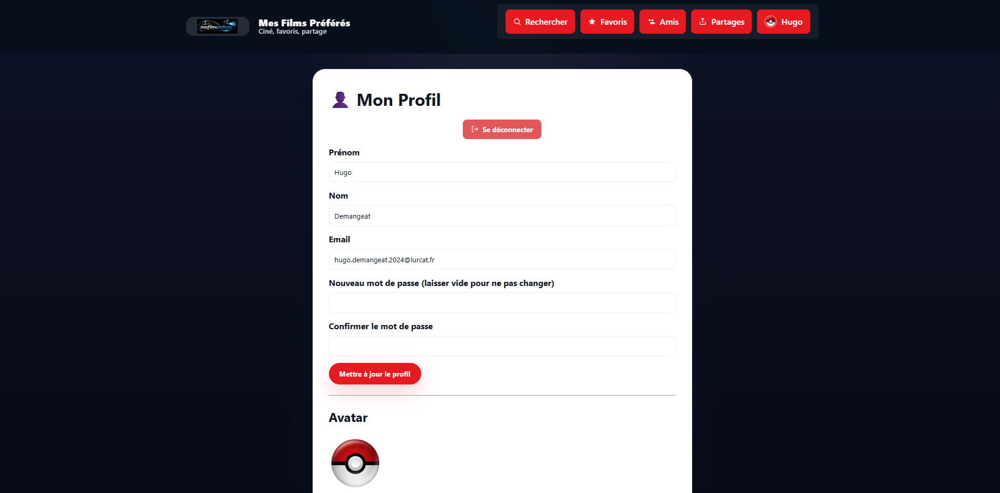
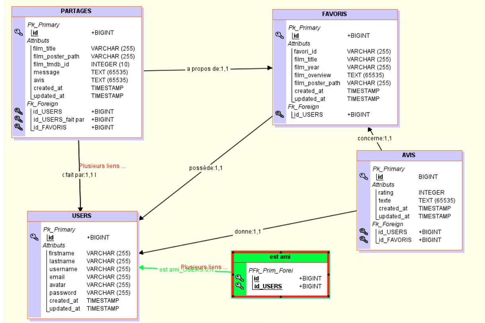

# Mes Films Préférés - API

Une application web Laravel permettant aux utilisateurs de découvrir, gérer et partager leurs films préférés avec leurs amis.

## Description

Cette application est une plateforme sociale centrée sur les films où les utilisateurs peuvent :
- Rechercher des films via l'API TMDB (The Movie Database)
- Ajouter des films à leurs favoris personnels
- Donner des avis sur leurs films favoris
- Gérer une liste d'amis
- Partager des films avec leurs amis
- Consulter les détails complets des films (synopsis, casting, bandes-annonces)

## Fonctionnalités

### Gestion des Utilisateurs
- Inscription et connexion sécurisées
- Profils utilisateurs avec avatars personnalisables
- Mise à jour des informations de profil

### Recherche et Découverte de Films
- Recherche par titre via l'API TMDB
- Affichage des films populaires, à venir, en salle et les mieux notés
- Détails complets des films : synopsis, casting, bandes-annonces YouTube

### Gestion des Favoris
- Ajout/suppression de films aux favoris
- Attribution d'avis personnels sur les films favoris
- Liste personnelle des films favoris

### Réseau Social
- Recherche et ajout d'amis
- Gestion de la liste d'amis (ajout/suppression)
- Partage de films avec les amis
- Consultation des partages reçus

### APIs TMDB
- Recherche d'utilisateurs pour ajouter des amis
- Recherche de films en temps réel
- Recherche d'amis existants
- Catégorisation des films (populaires, à venir, etc.)

## Prérequis

Avant d'installer l'application, assurez-vous d'avoir installé :

- **PHP** >= 8.2
- **Composer** (gestionnaire de dépendances PHP)
- **Node.js** et **npm** (pour la compilation des assets front-end)
- **Serveur web** (Apache/Nginx) ou utiliser le serveur de développement Laravel
- **Base de données** (MySQL, PostgreSQL, SQLite, etc.) - Recommandé : MySQL avec XAMPP

## Installation

### 1. Cloner le dépôt

```bash
git clone https://github.com/Hugo-Demangeat/mesfilmspreferes-api.git
cd mesfilmspreferes-api
```

### 2. Installer les dépendances PHP

```bash
composer install
```

### 3. Configuration de l'environnement

Copiez le fichier d'exemple d'environnement :

```bash
cp .env.example .env
```

Modifiez le fichier `.env` pour configurer votre base de données :

```env
DB_CONNECTION=mysql
DB_HOST=127.0.0.1
DB_PORT=3306
DB_DATABASE=mesfilmspreferes
DB_USERNAME=votre_username
DB_PASSWORD=votre_password
```

### 4. Générer la clé d'application

```bash
php artisan key:generate
```

### 5. Migrer la base de données

```bash
php artisan migrate
```

### 6. Installer les dépendances front-end

```bash
npm install
```

### 7. Compiler les assets

Pour le développement :
```bash
npm run dev
```

Pour la production :
```bash
npm run build
```

## Utilisation

### Lancer l'application

Utilisez la commande de développement incluse qui lance plusieurs services :

```bash
composer run dev
```

Ou lancez manuellement :

```bash
# Serveur web
php artisan serve
```

L'application sera accessible sur `http://localhost:8000`

### Guide d'utilisation

1. **Inscription / connexion**
   - Accédez à la page de connexion.
   - Créez un compte si vous n'en avez pas encore.
   - Connectez-vous ensuite avec votre email et votre mot de passe.

   

2. **Création de compte**
   - Remplissez prénom, nom, nom d'utilisateur, email et mot de passe.
   - Confirmez le mot de passe pour valider l'inscription.

   

3. **Recherche d'un film**
   - Entrez un titre dans la barre de recherche.
   - Utilisez les suggestions automatiques ou soumettez le formulaire.
   - Parcourez les résultats et cliquez sur un film pour voir sa fiche.

   

4. **Consultation du détail d'un film**
   - Depuis les résultats, ouvrez la fiche du film.
   - Voir le synopsis, la note TMDB, la durée et la bande-annonce.
   - Ajoutez le film à vos favoris ou supprimez-le si déjà ajouté.

   

5. **Gérer les favoris**
   - Consultez vos films favoris depuis la page "Mes Favoris".
   - Supprimez un favori ou ajoutez un avis personnel.
   - Donnez une note de 1 à 5 et enregistrez votre avis.

   

6. **Gérer les amis**
   - Recherchez un utilisateur par nom ou pseudo.
   - Cliquez sur un résultat pour sélectionner l'ami, puis ajoutez-le.
   - Supprimez un ami depuis la liste si nécessaire.

   

7. **Partager un film**
   - Choisissez un ami dans votre réseau.
   - Indiquez le titre du film à partager et un message optionnel.
   - Envoyez le partage et consultez les partages reçus ou envoyés.

   

8. **Consulter et modifier le profil**
   - Accédez à votre page de profil pour voir vos informations.
   - Modifiez votre prénom, nom, email et mot de passe si besoin.
   - Changez votre avatar en téléchargeant une nouvelle image.

   

### Modèle conceptuel de données (MCD)

Le schéma MCD du projet décrit les entités principales et leurs relations :

- Utilisateur
- Favoris
- Partage
- Avis
- Amitiés



## Structure du Projet

```
app/
├── Http/Controllers/     # Contrôleurs (Film, Favori, Ami, etc.)
├── Models/              # Modèles Eloquent (User, Favori, Partage, etc.)
config/                  # Configuration Laravel

database/
├── migrations/          # Migrations de base de données
├── seeders/            # Seeders pour données de test
public/                  # Assets publics et avatars

resources/
├── views/              # Templates Blade
├── js/                 # JavaScript/Vue.js
├── css/                # Styles CSS

routes/
├── web.php             # Routes de l'application
```

## Technologies Utilisées

- **Laravel 12** : Framework PHP
- **TMDB API** : Base de données de films
- **MySQL** : Base de données
- **Blade** : Moteur de templates
- **Tailwind CSS** : Framework CSS
- **Alpine.js** : Framework JavaScript
- **Vite** : Outil de build front-end

## Auteur

Hugo Demangeat
